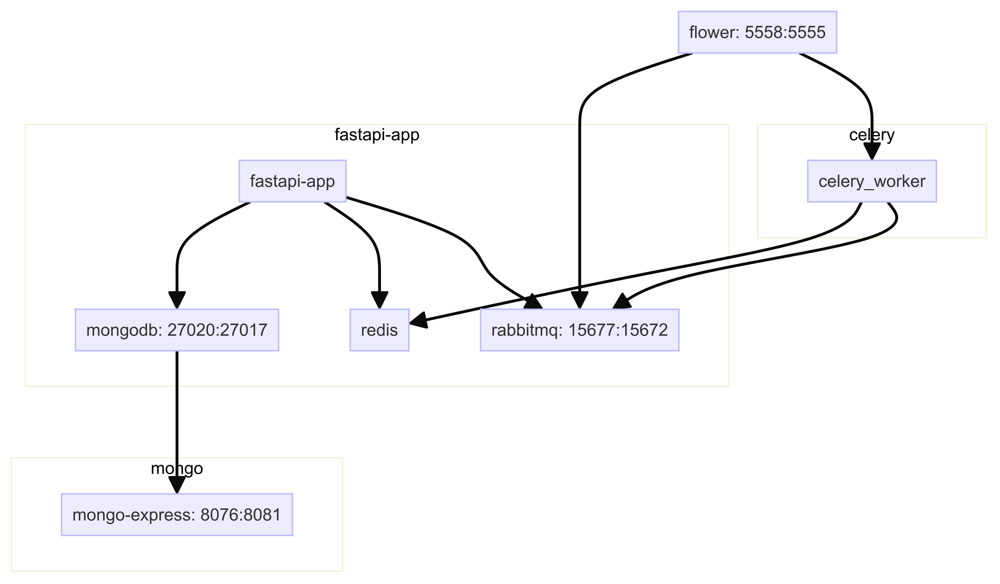

# Intro.

The fast api will hold two endpoints one to submit email task, other to get the status of the task. rabbit mq will be used as a message broker and mongodb will be used a result backend, celery is the asyncronous task execution system, celery worker will take the task from queue and after completion send results to result backend, monogdb UI can be used to access the mongodb records and the flower UI can be used to keep track of rabbit mq queues and the workers statistics.


# Services dependency

This diagram shows the dependency between the services in docker compose file.





Here redis has been shown as the result backend, however in actual implementation mongodb has been used as result backend.


# Ports 

When all services are up, following ports can be accessed using `localhost:<port>` to access the respective pages of services:

| Service Name | Host Port |
| --- | --- |
| fastapi-app | 8022 |
| mongodb | 27020 |
| mongo-express | 8076 |
| rabbitmq | 15677 |
| flower | 5558 |


> NOTE: All services use different ports to communicate with each other inside the docker network. Above mentioned ports are exposed to host so that sevices are accesssible from outside the container.


Following diagram shows how the celery worker process and child processes against each worker will be working together.




# fastapi-celery-flower-rabbitmq-redis

This repository serves as an illustrative example of implementing FastAPI with Celery within Docker containers. The underlying architecture involves Celery utilizing RabbitMQ as the message broker and Redis as the backend.

The example demonstrates a simulation where fictitious emails are sent through a FastAPI-powered REST API. The email sending process, though simulated, may take between 1 to 4 seconds. Thanks to the asynchronous queue management of Celery, the application remains unblocked throughout this process.

## Requirements

To successfully run and understand this example, ensure you have the following components installed:

- **Git**
- **Docker Compose** (version 19.03.0+)

## Running

Following will build the containers and spin up service containers:

```bash

make start

```

## Scale Celery workers

While the services are all up, following command can be used to scale the celery workers:

```bash
make scale

```

This will attach more workers with the existing rabbit-mq queue. Nothing else will be disturbed.


## Note

| Celery config. | Technologies |
| --- | --- |
| Result Backend | MongoDB |
| Message Broker | RabbitMQ |


Redis can also be used as a result backend, just see the celery worker python file, and uncomment that portion.